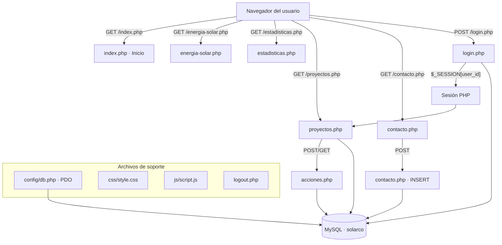
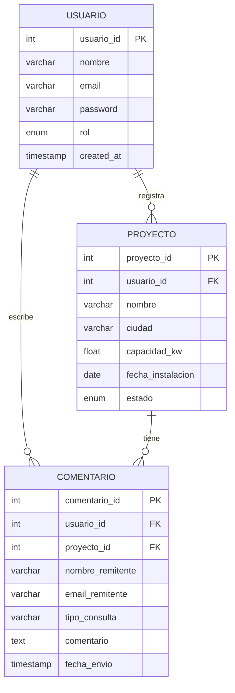
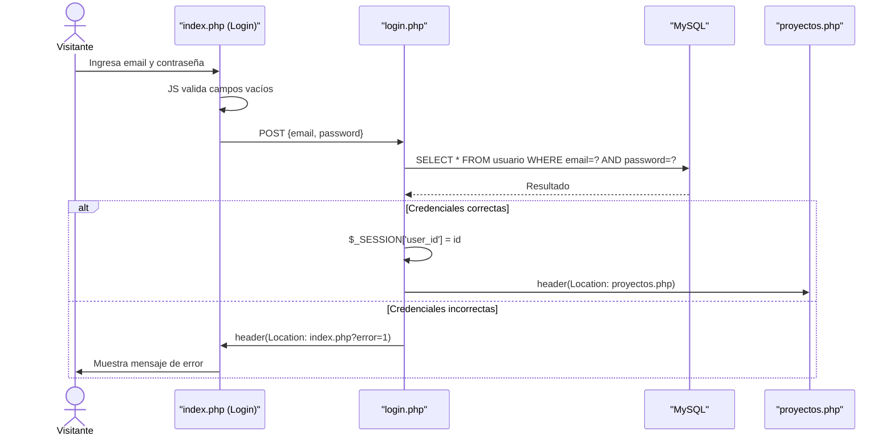
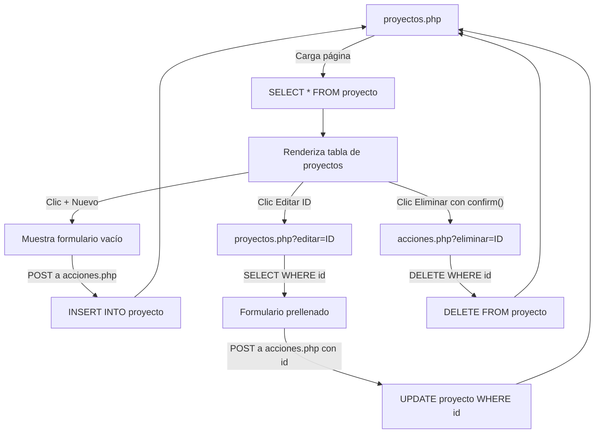
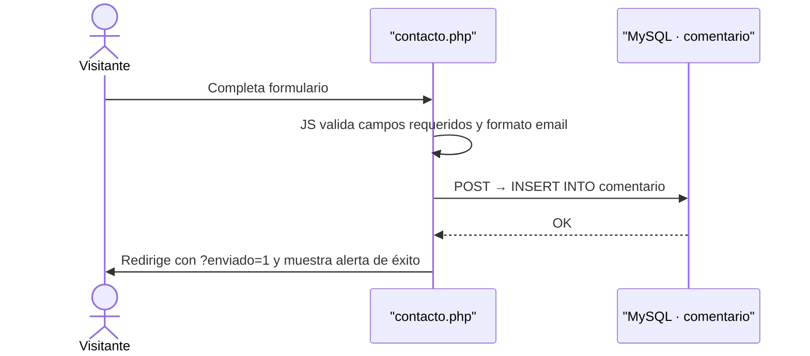

# BLUEPRINT — SolarCO
## Plataforma Web de Gestión de Energía Solar

**Versión:** 1.0 — Entrega 3  
**Fecha:** Junio 2026  
**Estado:** En desarrollo

---

## Propósito del documento

Este documento es la fuente de verdad técnica del proyecto SolarCO. Define la arquitectura, la estructura de archivos, el modelo de datos, los flujos de navegación, las convenciones de código y las responsabilidades de cada módulo. Todo integrante del equipo debe leerlo antes de comenzar a desarrollar y consultarlo ante cualquier duda de implementación.

---

## 1. Descripción del Proyecto

**SolarCO** es una plataforma web informativa y de gestión para una empresa colombiana de instalación de energía solar fotovoltaica. Permite a visitantes conocer los servicios y proyectos de la empresa, y a un administrador gestionar el portafolio de proyectos instalados y los mensajes de contacto recibidos.

### 1.1 Alcance de la Entrega 3

| Componente | Descripción |
|---|---|
| Frontend | 6 páginas HTML5 semántico con CSS3 y JavaScript puro |
| Backend | PHP procedimental con PDO para conexión a MySQL |
| Base de datos | MySQL (XAMPP), 3 tablas relacionadas |
| CRUD principal | Gestión de proyectos solares (crear, listar, editar, eliminar) |
| CRUD secundario | Formulario de contacto con persistencia en base de datos |
| Autenticación | Login de administrador con sesiones PHP |

### 1.2 Stack tecnológico

| Capa | Tecnología | Restricción |
|---|---|---|
| Frontend | HTML5, CSS3, JavaScript ES5/ES6 puro | Sin frameworks (no Bootstrap, no jQuery) |
| Backend | PHP 8.x | Sin frameworks (no Laravel, no Symfony) |
| Base de datos | MySQL 8.x vía XAMPP | Sin ORM |
| Conexión BD | PDO con prepared statements | No usar `mysqli_*` directo |
| Entorno local | XAMPP + Laravel (Laragon) | Puerto 80, host `localhost` |
| Control de versiones | GitHub | Rama `main` como producción |

---

## 2. Arquitectura del Sistema

### 2.1 Diagrama de arquitectura



### 2.2 Tipo de arquitectura

El proyecto sigue una arquitectura **MVC simplificada sin framework**, donde:

- Las páginas `.php` actúan como **Vista + Controlador** combinados (patrón enseñado en clase).
- `acciones.php` actúa como **Controlador exclusivo** para operaciones de escritura en la BD.
- `config/db.php` es la **capa de configuración** de datos, compartida por todos los archivos.

---

## 3. Estructura de Archivos

```
web_17/                          ← Carpeta raíz del proyecto (c:\laragon\www\web_17\)
│
├── index.php                    ← Página de inicio (pública)
├── energia-solar.php            ← Página de servicios (pública)
├── estadisticas.php             ← Panel de estadísticas (pública)
├── proyectos.php                ← Gestión de proyectos (lectura pública / escritura privada)
├── contacto.php                 ← Formulario de contacto (pública, escribe en BD)
├── login.php                    ← Procesa autenticación (POST)
├── logout.php                   ← Destruye sesión y redirige
├── acciones.php                 ← Procesa operaciones CRUD de proyectos
│
├── config/
│   └── db.php                   ← Conexión PDO a MySQL
│
├── css/
│   └── style.css                ← Estilos globales del proyecto
│
├── js/
│   └── script.js                ← Validaciones dinámicas con JavaScript puro
│
├── imgs_project/                ← Imágenes del diseño Figma (referencia)
│   ├── 0.png                    ← Pantalla Login
│   ├── 1.png                    ← Pantalla Inicio
│   ├── 2.png                    ← Pantalla Energía Solar
│   ├── 3.png                    ← Pantalla Estadísticas
│   ├── 4.png                    ← Pantalla Proyectos
│   └── 5.png                    ← Pantalla Contacto
│
├── solarco.sql                  ← Exportación completa de la base de datos
├── BLUEPRINT.md                 ← Este documento
├── TASKS.md                     ← Plan de ejecución del proyecto
└── README.md                    ← Instrucciones de instalación
```

---

## 4. Modelo de Datos

### 4.1 Diagrama Entidad-Relación



### 4.2 Detalle de tablas

#### Tabla `usuario`
| Campo | Tipo | Restricción | Descripción |
|---|---|---|---|
| `usuario_id` | INT | PK, AUTO_INCREMENT | Identificador único |
| `nombre` | VARCHAR(100) | NOT NULL | Nombre completo |
| `email` | VARCHAR(150) | NOT NULL, UNIQUE | Correo electrónico (usado para login) |
| `password` | VARCHAR(255) | NOT NULL | Contraseña en texto plano |
| `rol` | ENUM | DEFAULT 'admin' | Rol del usuario en el sistema |
| `created_at` | TIMESTAMP | DEFAULT NOW() | Fecha de creación |

#### Tabla `proyecto`
| Campo | Tipo | Restricción | Descripción |
|---|---|---|---|
| `proyecto_id` | INT | PK, AUTO_INCREMENT | Identificador único |
| `usuario_id` | INT | FK → usuario | Administrador que lo registró |
| `nombre` | VARCHAR(150) | NOT NULL | Nombre descriptivo del proyecto |
| `ciudad` | VARCHAR(100) | NOT NULL | Ciudad de instalación |
| `capacidad_kw` | FLOAT | NOT NULL | Capacidad instalada en kilovatios |
| `fecha_instalacion` | DATE | NOT NULL | Fecha de instalación |
| `estado` | ENUM | DEFAULT 'Planificación' | Estado actual: Activo / En proceso / Planificación |

#### Tabla `comentario`
| Campo | Tipo | Restricción | Descripción |
|---|---|---|---|
| `comentario_id` | INT | PK, AUTO_INCREMENT | Identificador único |
| `usuario_id` | INT | FK → usuario, NULL | NULL si es visitante anónimo |
| `proyecto_id` | INT | FK → proyecto, NULL | NULL si es consulta general |
| `nombre_remitente` | VARCHAR(100) | NOT NULL | Nombre de quien envía el mensaje |
| `email_remitente` | VARCHAR(150) | NOT NULL | Correo de respuesta |
| `tipo_consulta` | VARCHAR(80) | DEFAULT 'General' | Categoría de la consulta |
| `comentario` | TEXT | NOT NULL | Cuerpo del mensaje |
| `fecha_envio` | TIMESTAMP | DEFAULT NOW() | Fecha y hora del envío |

### 4.3 Script SQL de creación

```sql
CREATE DATABASE IF NOT EXISTS solarco CHARACTER SET utf8 COLLATE utf8_spanish_ci;
USE solarco;

CREATE TABLE usuario (
    usuario_id  INT AUTO_INCREMENT PRIMARY KEY,
    nombre      VARCHAR(100)  NOT NULL,
    email       VARCHAR(150)  NOT NULL UNIQUE,
    password    VARCHAR(255)  NOT NULL,
    rol         ENUM('admin','cliente') DEFAULT 'admin',
    created_at  TIMESTAMP DEFAULT CURRENT_TIMESTAMP
);

CREATE TABLE proyecto (
    proyecto_id       INT AUTO_INCREMENT PRIMARY KEY,
    usuario_id        INT NOT NULL,
    nombre            VARCHAR(150) NOT NULL,
    ciudad            VARCHAR(100) NOT NULL,
    capacidad_kw      FLOAT        NOT NULL,
    fecha_instalacion DATE         NOT NULL,
    estado            ENUM('Activo','En proceso','Planificación') DEFAULT 'Planificación',
    FOREIGN KEY (usuario_id) REFERENCES usuario(usuario_id) ON DELETE CASCADE
);

CREATE TABLE comentario (
    comentario_id    INT AUTO_INCREMENT PRIMARY KEY,
    usuario_id       INT,
    proyecto_id      INT,
    nombre_remitente VARCHAR(100) NOT NULL,
    email_remitente  VARCHAR(150) NOT NULL,
    tipo_consulta    VARCHAR(80)  DEFAULT 'General',
    comentario       TEXT         NOT NULL,
    fecha_envio      TIMESTAMP    DEFAULT CURRENT_TIMESTAMP,
    FOREIGN KEY (usuario_id)  REFERENCES usuario(usuario_id)  ON DELETE SET NULL,
    FOREIGN KEY (proyecto_id) REFERENCES proyecto(proyecto_id) ON DELETE SET NULL
);

-- Datos de prueba
INSERT INTO usuario (nombre, email, password, rol)
VALUES ('Admin SolarCO', 'admin@solarco.com', 'admin123', 'admin');

INSERT INTO proyecto (usuario_id, nombre, ciudad, capacidad_kw, fecha_instalacion, estado) VALUES
(1, 'Solar Residencial - Bogotá Norte', 'Bogotá',    5.5,  '2026-01-15', 'Activo'),
(1, 'Edificio Comercial - Medellín',    'Medellín',  45.0, '2026-02-20', 'En proceso'),
(1, 'Planta Industrial - Cali',         'Cali',      120.0,'2025-11-10', 'Activo'),
(1, 'Conjunto Residencial - Barranquilla','Barranquilla',85.0,'2026-03-05','Planificación');

INSERT INTO comentario (nombre_remitente, email_remitente, tipo_consulta, comentario) VALUES
('Juan Pérez',  'juan@email.com',  'Solicitud de cotización', 'Quiero información sobre paneles para mi casa en Bogotá.'),
('María López', 'maria@email.com', 'Soporte técnico',         'Mi sistema no está generando la capacidad esperada este mes.');
```

---

## 5. Flujos del Sistema

### 5.1 Flujo de autenticación



### 5.2 Flujo CRUD de proyectos



### 5.3 Flujo del formulario de contacto



---

## 6. Descripción de Módulos

### 6.1 `config/db.php` — Conexión a base de datos
- Establece la conexión PDO a MySQL.
- Se incluye con `require 'config/db.php'` en cada archivo que necesite base de datos.
- Expone la variable `$pdo` al archivo que lo incluye.
- **Nombre de la BD:** `solarco`

### 6.2 `index.php` — Página de inicio (pública)
- Hero section con título, subtítulo y dos botones CTA.
- Sección de beneficios con tres tarjetas (Ahorro Energético, Energía Limpia, Retorno de Inversión).
- Banda de estadísticas (500+ proyectos, 25 MW, 15K toneladas CO₂, 98% satisfacción).
- Doble función: también sirve como pantalla de login cuando el admin accede al menú "Iniciar Sesión".

### 6.3 `login.php` — Procesador de autenticación
- Solo acepta peticiones POST.
- Verifica credenciales contra la tabla `usuario` usando PDO con prepared statements.
- Si es válido: inicia `$_SESSION['user_id']` y `$_SESSION['nombre']` → redirige a `proyectos.php`.
- Si es inválido: redirige a `index.php?error=1`.

### 6.4 `logout.php` — Cierre de sesión
- Llama a `session_start()`, `session_destroy()`.
- Redirige a `index.php`.

### 6.5 `energia-solar.php` — Servicios (pública)
- Dos tarjetas: Sistemas Residenciales y Sistemas Comerciales.
- Sección "¿Por qué Energía Solar?" con métricas (100% renovable, 25 años vida útil, 0% emisiones).
- Contenido estático, sin conexión a base de datos.

### 6.6 `estadisticas.php` — Panel de estadísticas (pública)
- 4 tarjetas de métricas: Energía Generada, Ahorro Total, CO₂ Evitado, Proyectos Activos.
- Gráfica de barras (Producción vs Consumo) y gráfica de línea (Tendencia) usando `<canvas>` con datos estáticos en JavaScript.
- Distribución por sector (gráfica de torta) y Resumen Mensual.
- Contenido estático, sin conexión a base de datos.

### 6.7 `proyectos.php` — Gestión de proyectos (lectura pública / escritura protegida)
- Lee y muestra todos los proyectos desde la BD en una tabla HTML.
- Si el usuario tiene sesión activa (`$_SESSION['user_id']`), muestra el formulario de creación/edición y los botones de acción.
- Si no hay sesión, solo muestra la tabla (modo lectura).
- La edición se activa vía `?editar=ID` que prelllena el formulario.

### 6.8 `acciones.php` — Controlador CRUD
- No renderiza HTML.
- Acepta GET para eliminar (`?eliminar=ID`) y POST para crear/editar.
- Verifica que exista sesión activa antes de procesar cualquier operación.
- Redirige siempre a `proyectos.php` al terminar.

### 6.9 `contacto.php` — Formulario de contacto (pública)
- Formulario con campos: Nombre, Apellido, Email, Teléfono, Tipo de Consulta (select), Mensaje.
- Información de contacto de la empresa al lado derecho.
- Al enviar, realiza INSERT en la tabla `comentario` y redirige con `?enviado=1`.
- Muestra mensaje de confirmación con PHP si `$_GET['enviado'] == 1`.

### 6.10 `css/style.css` — Estilos globales
- Define la paleta de colores del proyecto.
- Contiene estilos para navbar, hero, tarjetas, tablas, formularios y footer.
- No se usan estilos en línea dentro del HTML.

**Paleta de colores oficial:**

| Token | Valor HEX | Uso |
|---|---|---|
| Amarillo primario | `#C9960C` | Botones CTA, acentos, íconos |
| Azul marino | `#1C2B4A` | Navbar, títulos, fondos de banda |
| Fondo claro | `#F5F5F0` | Fondo general de páginas |
| Blanco | `#FFFFFF` | Tarjetas, formularios |
| Gris texto | `#6B7280` | Texto secundario y descriptivo |

### 6.11 `js/script.js` — Validaciones dinámicas
- Valida el formulario de login: campos vacíos.
- Valida el formulario de contacto: campos obligatorios, formato de email.
- Valida el formulario de nuevo proyecto: campos numéricos positivos.
- Usa exclusivamente JavaScript puro: `document.getElementById`, `addEventListener`, `preventDefault`.

---

## 7. Convenciones de Código

### 7.1 PHP
- Todo archivo con lógica de sesión inicia con `session_start()` en la primera línea.
- La conexión a BD se incluye con `require 'config/db.php'` (no `include`).
- Se usan siempre **prepared statements** con PDO para cualquier consulta que reciba datos del usuario.
- Las redirecciones se hacen con `header("Location: archivo.php")` seguido inmediatamente de `exit`.
- Los valores de formularios se acceden via `$_POST['campo']` y se asignan a variables antes de usarlos.

### 7.2 HTML
- Cada página tiene estructura semántica completa: `<header>`, `<nav>`, `<main>`, `<section>`, `<footer>`.
- Un único `<h1>` por página.
- Todos los campos de formulario tienen atributo `name` y `id`.
- Los formularios de escritura usan `method="POST"`.
- Los formularios de filtrado/búsqueda usan `method="GET"`.

### 7.3 CSS
- Sin estilos en línea (`style="..."`) en los archivos HTML/PHP.
- La hoja de estilos se enlaza en el `<head>` de cada página: `<link rel="stylesheet" href="css/style.css">`.
- Los selectores siguen nomenclatura en español para consistencia con el proyecto: `.tarjeta-proyecto`, `.btn-primario`, `.nav-principal`.

### 7.4 JavaScript
- El script se incluye al final del `<body>`: `<script src="js/script.js"></script>`.
- Sin `alert()` para validaciones de formulario (usar elementos HTML con mensajes de error visibles).
- Sí se permite `confirm()` para confirmar eliminaciones (patrón del profesor).

---

## 8. Control de Versiones

### 8.1 Convención de commits

```
[MODULO] descripcion breve del cambio

Ejemplos:
[BD] Crear script SQL con tablas y datos de prueba
[CSS] Definir paleta de colores y estilos del navbar
[LOGIN] Implementar validacion de credenciales con PDO
[CRUD] Completar operacion de edicion de proyectos
[CONTACTO] Agregar INSERT en tabla comentario
[FIX] Corregir redireccion en logout.php
```

### 8.2 Archivos que NO deben subirse al repositorio
- Archivos de configuración local de XAMPP.
- Carpetas `node_modules`, `.vscode` (si aplica).
- El archivo `solarco.sql` **SÍ debe subirse** — es un entregable obligatorio.

---

## 9. Instrucciones de Instalación

Para ejecutar el proyecto localmente:

1. Clonar el repositorio en `c:\laragon\www\web_17\`.
2. Abrir XAMPP y arrancar los servicios **Apache** y **MySQL**.
3. Abrir phpMyAdmin en `http://localhost/phpmyadmin`.
4. Crear la base de datos `solarco`.
5. Importar el archivo `solarco.sql` ubicado en la raíz del proyecto.
6. Abrir el navegador en `http://localhost/web_17/`.
7. Iniciar sesión con: `admin@solarco.com` / `admin123`.

---

## 10. Glosario

| Término | Definición |
|---|---|
| PDO | PHP Data Objects — capa de abstracción para conexión a bases de datos usada en este proyecto |
| CRUD | Create, Read, Update, Delete — las cuatro operaciones básicas sobre la base de datos |
| Sesión PHP | Mecanismo `$_SESSION` de PHP para mantener el estado de autenticación entre páginas |
| Prepared Statement | Consulta SQL parametrizada que previene inyección SQL |
| CTA | Call To Action — botón o enlace que invita al usuario a realizar una acción |
| Admin | Único usuario con acceso al panel de gestión de proyectos |
