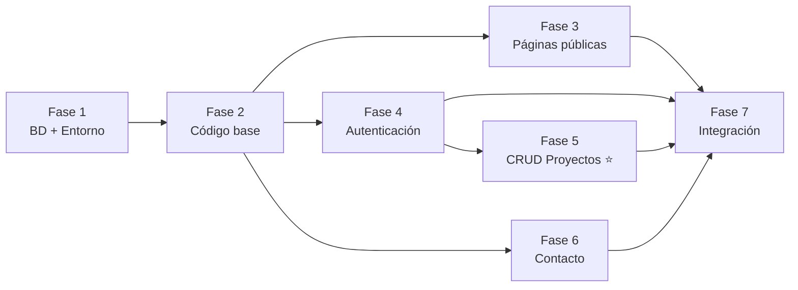

# TASKS — SolarCO
## Plan Maestro de Ejecución · Entrega 3

**Proyecto:** SolarCO — Plataforma Web de Energía Solar  
**Entrega:** 9 de junio de 2026  
**Valor académico:** 20%  
**Referencia:** Ver `BLUEPRINT.md` para arquitectura y decisiones técnicas

---

## Leyenda

| Símbolo | Significado |
|---|---|
| `[ ]` | Tarea pendiente |
| `[/]` | Tarea en progreso |
| `[x]` | Tarea completada |
| 🔴 Alta | Prioridad crítica — bloquea a otras tareas |
| 🟡 Media | Importante — no bloquea pero afecta la calidad |
| 🟢 Baja | Complementaria — se hace si hay tiempo |
| ⚙️ Baja | Complejidad de implementación baja |
| ⚙️⚙️ Media | Complejidad de implementación media |
| ⚙️⚙️⚙️ Alta | Complejidad de implementación alta |

---

## FASE 1 — Infraestructura y Base de Datos

> **Objetivo:** Tener el entorno local funcionando y la base de datos creada antes de escribir cualquier archivo PHP o HTML.  
> **Dependencia:** Esta fase no depende de ninguna otra. Todas las demás fases dependen de esta.  
> **Responsable sugerido:** Sergio

---

### Módulo 1.1 — Entorno y repositorio

| # | Tarea | Prioridad | Complejidad | Criterio de finalización |
|---|---|---|---|---|
| 1.1.1 | `[x]` Verificar que XAMPP esté corriendo (Apache + MySQL activos) | 🔴 Alta | ⚙️ Baja | `http://localhost` responde en el navegador |
| 1.1.2 | `[x]` Confirmar que la carpeta del proyecto es `c:\laragon\www\solarco\` | 🔴 Alta | ⚙️ Baja | El proyecto abre en `http://localhost/solarco/` |
| 1.1.3 | `[x]` Crear repositorio en GitHub (o verificar que ya existe) | 🔴 Alta | ⚙️ Baja | URL del repo compartida con todo el equipo |
| 1.1.4 | `[x]` Hacer el primer commit con `BLUEPRINT.md` y `TASKS.md` | 🟡 Media | ⚙️ Baja | Archivos visibles en GitHub |

---

### Módulo 1.2 — Base de datos MySQL

| # | Tarea | Prioridad | Complejidad | Criterio de finalización | Dependencia |
|---|---|---|---|---|---|
| 1.2.1 | `[x]` Abrir phpMyAdmin en `http://localhost/phpmyadmin` | 🔴 Alta | ⚙️ Baja | phpMyAdmin carga correctamente | 1.1.1 |
| 1.2.2 | `[x]` Crear la base de datos llamada exactamente `solarco` con charset `utf8` | 🔴 Alta | ⚙️ Baja | BD aparece en el panel izquierdo de phpMyAdmin | 1.2.1 |
| 1.2.3 | `[x]` Ejecutar el script SQL del `BLUEPRINT.md` (sección 4.3) para crear las 3 tablas | 🔴 Alta | ⚙️ Baja | Tablas `usuario`, `proyecto`, `comentario` creadas con todas sus columnas | 1.2.2 |
| 1.2.4 | `[x]` Insertar los datos de prueba del script SQL (INSERT INTO) | 🔴 Alta | ⚙️ Baja | phpMyAdmin muestra 1 usuario, 4 proyectos y 2 comentarios | 1.2.3 |
| 1.2.5 | `[x]` Verificar las llaves foráneas en el diagrama de phpMyAdmin | 🟡 Media | ⚙️ Baja | Las relaciones aparecen correctas en la vista de diseño | 1.2.4 |

**✅ Definition of Done — Fase 1:**
- XAMPP corriendo sin errores.
- BD `solarco` creada con 3 tablas y datos de prueba.
- Repositorio GitHub inicializado.

---

## FASE 2 — Infraestructura de código

> **Objetivo:** Crear los archivos base que serán compartidos por todas las páginas: conexión a BD, estilos CSS y validaciones JS.  
> **Dependencia:** Requiere Fase 1 completa.

---

### Módulo 2.1 — Conexión a base de datos

| # | Tarea | Prioridad | Complejidad | Criterio de finalización | Dependencia |
|---|---|---|---|---|---|
| 2.1.1 | `[x]` Crear carpeta `config/` en la raíz del proyecto | 🔴 Alta | ⚙️ Baja | Carpeta existe en `solarco/config/` | 1.2.2 |
| 2.1.2 | `[x]` Crear `config/db.php` con conexión PDO a `solarco` | 🔴 Alta | ⚙️ Baja | El archivo no lanza errores al incluirse con `require` | 2.1.1 |

**Código esperado de `config/db.php`:**
```php
<?php
$host = 'localhost';
$db   = 'solarco';
$user = 'root';
$pass = '';

try {
    $pdo = new PDO("mysql:host=$host;dbname=$db;charset=utf8", $user, $pass);
    $pdo->setAttribute(PDO::ATTR_ERRMODE, PDO::ERRMODE_EXCEPTION);
} catch (PDOException $e) {
    die("Error de conexión: " . $e->getMessage());
}
?>
```

---

### Módulo 2.2 — Estilos globales CSS

| # | Tarea | Prioridad | Complejidad | Criterio de finalización | Dependencia |
|---|---|---|---|---|---|
| 2.2.1 | `[ ]` Crear carpeta `css/` en la raíz del proyecto | 🔴 Alta | ⚙️ Baja | Carpeta existe en `web_17/css/` | — |
| 2.2.2 | `[ ]` Crear `css/style.css` con reset CSS y variables de color | 🔴 Alta | ⚙️ Media | Variables `--amarillo`, `--azul-marino`, `--fondo` definidas y aplicadas | 2.2.1 |
| 2.2.3 | `[ ]` Implementar estilos del navbar (logo + links + botón CTA) | 🔴 Alta | ⚙️ Media | El navbar se ve igual al diseño Figma `imgs_project/1.png` | 2.2.2 |
| 2.2.4 | `[ ]` Implementar estilos de tarjetas (`.card`), botones (`.btn-primary`) y formularios | 🟡 Media | ⚙️ Media | Los componentes se ven consistentes en todas las páginas | 2.2.3 |
| 2.2.5 | `[ ]` Implementar estilos de tabla HTML para la vista de proyectos | 🟡 Media | ⚙️ Media | La tabla se ve igual al diseño Figma `imgs_project/4.png` | 2.2.4 |
| 2.2.6 | `[ ]` Implementar estilos de footer | 🟢 Baja | ⚙️ Baja | Footer visible y consistente en todas las páginas | 2.2.2 |

---

### Módulo 2.3 — JavaScript de validaciones

| # | Tarea | Prioridad | Complejidad | Criterio de finalización | Dependencia |
|---|---|---|---|---|---|
| 2.3.1 | `[ ]` Crear carpeta `js/` en la raíz del proyecto | 🔴 Alta | ⚙️ Baja | Carpeta existe en `web_17/js/` | — |
| 2.3.2 | `[ ]` Crear `js/script.js` con validación del formulario de login | 🔴 Alta | ⚙️ Media | El botón de login no envía el formulario si los campos están vacíos y muestra mensaje | 2.3.1 |
| 2.3.3 | `[ ]` Agregar validación del formulario de contacto (campos obligatorios + formato email) | 🟡 Media | ⚙️ Media | El formulario de contacto no envía si hay errores y los muestra en pantalla | 2.3.2 |
| 2.3.4 | `[ ]` Agregar validación del formulario de nuevo proyecto (capacidad_kw debe ser número positivo) | 🟡 Media | ⚙️ Baja | El formulario no envía si `capacidad_kw` es cero o negativo | 2.3.2 |

**✅ Definition of Done — Fase 2:**
- `config/db.php` conecta a MySQL sin errores.
- `css/style.css` aplica la paleta amarillo/azul marino del Figma.
- `js/script.js` valida al menos 2 formularios.

---

## FASE 3 — Páginas públicas informativas

> **Objetivo:** Construir las páginas que cualquier visitante puede ver, sin autenticación ni base de datos.  
> **Dependencia:** Requiere Fase 2 (CSS) para aplicar estilos correctamente.

---

### Módulo 3.1 — Página de Inicio (`index.php`)

Referencia visual: `imgs_project/1.png`

| # | Tarea | Prioridad | Complejidad | Criterio de finalización |
|---|---|---|---|---|
| 3.1.1 | `[ ]` Crear estructura HTML semántica de `index.php` con `<header>`, `<main>`, `<footer>` | 🔴 Alta | ⚙️ Baja | Página abre en `http://localhost/web_17/` sin errores |
| 3.1.2 | `[ ]` Implementar navbar con logo SolarCO, links de navegación y botón "Iniciar Sesión" | 🔴 Alta | ⚙️ Media | El navbar coincide con el diseño Figma |
| 3.1.3 | `[ ]` Implementar Hero section (título, subtítulo, dos botones CTA, imagen/ícono del sol) | 🔴 Alta | ⚙️⚙️ Media | La sección hero se ve igual al diseño Figma |
| 3.1.4 | `[ ]` Implementar sección "Beneficios" con 3 tarjetas (Ahorro Energético, Energía Limpia, Retorno de Inversión) | 🟡 Media | ⚙️ Media | Las 3 tarjetas tienen ícono, título y descripción |
| 3.1.5 | `[ ]` Implementar banda de estadísticas (500+, 25 MW, 15K, 98%) sobre fondo azul marino | 🟡 Media | ⚙️ Media | La banda estadística coincide con el diseño Figma |
| 3.1.6 | `[ ]` Agregar formulario de login modal o sección de login al hacer clic en "Iniciar Sesión" | 🔴 Alta | ⚙️⚙️ Media | El formulario de login aparece y envía a `login.php` |

---

### Módulo 3.2 — Página Energía Solar (`energia-solar.php`)

Referencia visual: `imgs_project/2.png`

| # | Tarea | Prioridad | Complejidad | Criterio de finalización |
|---|---|---|---|---|
| 3.2.1 | `[ ]` Crear `energia-solar.php` con estructura HTML semántica y navbar | 🟡 Media | ⚙️ Baja | Página carga desde el link del navbar |
| 3.2.2 | `[ ]` Implementar hero section de la página (título + subtítulo sobre fondo beige) | 🟡 Media | ⚙️ Baja | La sección se ve igual al diseño Figma |
| 3.2.3 | `[ ]` Implementar 2 tarjetas de servicio (Sistemas Residenciales y Sistemas Comerciales) con lista de características | 🟡 Media | ⚙️ Media | Las dos tarjetas tienen ícono, título, descripción y lista de ítems |
| 3.2.4 | `[ ]` Implementar sección "¿Por qué Energía Solar?" con 3 métricas (100%, 25 años, 0%) | 🟢 Baja | ⚙️ Baja | La sección de métricas es visible y consistente |

---

### Módulo 3.3 — Panel de Estadísticas (`estadisticas.php`)

Referencia visual: `imgs_project/3.png`

| # | Tarea | Prioridad | Complejidad | Criterio de finalización |
|---|---|---|---|---|
| 3.3.1 | `[ ]` Crear `estadisticas.php` con estructura HTML semántica y navbar | 🟡 Media | ⚙️ Baja | Página carga desde el link del navbar |
| 3.3.2 | `[ ]` Implementar 4 tarjetas de métricas (32,450 kWh, $45.2M, 18.5 ton, 1,247 proyectos) | 🟡 Media | ⚙️ Baja | Las 4 tarjetas se ven con el porcentaje de incremento |
| 3.3.3 | `[ ]` Implementar gráfica de barras "Producción vs Consumo" usando `<canvas>` y JS puro | 🟢 Baja | ⚙️⚙️⚙️ Alta | La gráfica de barras se renderiza con datos de los 6 meses |
| 3.3.4 | `[ ]` Implementar gráfica de línea "Tendencia de Producción" usando `<canvas>` y JS puro | 🟢 Baja | ⚙️⚙️⚙️ Alta | La gráfica de línea se renderiza correctamente |
| 3.3.5 | `[ ]` Implementar sección "Resumen Mensual" con tabla de datos estáticos | 🟢 Baja | ⚙️ Baja | La tabla muestra los datos de los últimos 4 meses |

> **Nota:** Las gráficas son de prioridad baja. Si el tiempo es limitado, mostrar los datos en formato de tabla HTML tiene el mismo valor académico.

**✅ Definition of Done — Fase 3:**
- Las 3 páginas cargan desde el navbar sin errores.
- El navbar es consistente en todas las páginas.
- El diseño sigue la paleta de colores del Figma.

---

## FASE 4 — Sistema de Autenticación

> **Objetivo:** Implementar login y logout con sesiones PHP para proteger las operaciones del CRUD.  
> **Dependencia:** Requiere Fase 2 (`config/db.php` + formulario de login en `index.php`).  

---

### Módulo 4.1 — Login

| # | Tarea | Prioridad | Complejidad | Criterio de finalización | Dependencia |
|---|---|---|---|---|---|
| 4.1.1 | `[ ]` Crear formulario de login en `index.php` (email + password) referenciando `login.php` | 🔴 Alta | ⚙️ Media | El formulario tiene `action="login.php" method="POST"` | 3.1.6 |
| 4.1.2 | `[ ]` Crear `login.php` que procese el POST y consulte la BD con PDO | 🔴 Alta | ⚙️⚙️ Media | El archivo existe y no tiene errores de sintaxis | 2.1.2 |
| 4.1.3 | `[ ]` Implementar lógica: si credenciales correctas → `$_SESSION` → redirigir a `proyectos.php` | 🔴 Alta | ⚙️⚙️ Media | El login con `admin@solarco.com / admin123` redirige correctamente | 4.1.2 |
| 4.1.4 | `[ ]` Implementar lógica: si credenciales incorrectas → redirigir a `index.php?error=1` | 🔴 Alta | ⚙️ Baja | Un login erróneo muestra mensaje de error visible en pantalla | 4.1.3 |

---

### Módulo 4.2 — Logout

| # | Tarea | Prioridad | Complejidad | Criterio de finalización | Dependencia |
|---|---|---|---|---|---|
| 4.2.1 | `[ ]` Crear `logout.php` con `session_start()`, `session_destroy()` y redirección a `index.php` | 🔴 Alta | ⚙️ Baja | Al acceder a `logout.php`, la sesión se destruye y el usuario vuelve al inicio | 4.1.3 |
| 4.2.2 | `[ ]` Agregar enlace "Cerrar Sesión" en el navbar (visible solo cuando hay sesión activa) | 🟡 Media | ⚙️ Media | El navbar muestra "Cerrar Sesión" tras login y "Iniciar Sesión" si no hay sesión | 4.2.1 |

**✅ Definition of Done — Fase 4:**
- Login con credenciales correctas crea la sesión y redirige.
- Login con credenciales incorrectas muestra error en pantalla.
- Logout destruye la sesión y redirige al inicio.
- El navbar refleja el estado de la sesión.

---

## FASE 5 — CRUD de Proyectos ⭐ NÚCLEO DE LA ENTREGA

> **Objetivo:** Implementar el CRUD completo de la tabla `proyecto`. Esta fase cumple el requisito principal de la entrega 3.  
> **Dependencia:** Requiere Fases 2 y 4 completas (BD + sesión activa).  
> **Responsable sugerido:** Sergio y Integrante B

---

### Módulo 5.1 — Listar proyectos (Read)

| # | Tarea | Prioridad | Complejidad | Criterio de finalización | Dependencia |
|---|---|---|---|---|---|
| 5.1.1 | `[ ]` Crear `proyectos.php` con `session_start()` y `require 'config/db.php'` | 🔴 Alta | ⚙️ Baja | Página carga sin errores PHP | 2.1.2 |
| 5.1.2 | `[ ]` Ejecutar `SELECT * FROM proyecto` y almacenar en variable `$proyectos` | 🔴 Alta | ⚙️ Baja | La consulta retorna los 4 proyectos de prueba | 5.1.1 |
| 5.1.3 | `[ ]` Renderizar la tabla HTML con las columnas: Proyecto, Ciudad, Capacidad kW, Estado, Fecha, Acciones | 🔴 Alta | ⚙️ Media | La tabla muestra todos los proyectos de la BD | 5.1.2 |
| 5.1.4 | `[ ]` Mostrar botones de Editar y Eliminar solo si `$_SESSION['user_id']` existe | 🔴 Alta | ⚙️ Media | Sin sesión: solo tabla. Con sesión: tabla + botones de acción | 5.1.3 |

---

### Módulo 5.2 — Crear proyecto (Create)

| # | Tarea | Prioridad | Complejidad | Criterio de finalización | Dependencia |
|---|---|---|---|---|---|
| 5.2.1 | `[ ]` Agregar formulario en `proyectos.php` (solo visible con sesión) con campos: nombre, ciudad, capacidad_kw, fecha_instalacion, estado | 🔴 Alta | ⚙️ Media | El formulario aparece encima de la tabla cuando hay sesión activa | 5.1.4 |
| 5.2.2 | `[ ]` El formulario apunta a `action="acciones.php" method="POST"` | 🔴 Alta | ⚙️ Baja | El formulario envía los datos a `acciones.php` | 5.2.1 |
| 5.2.3 | `[ ]` Crear `acciones.php` con `session_start()` y verificación de sesión | 🔴 Alta | ⚙️ Baja | Si no hay sesión, el archivo hace `exit` inmediatamente | 4.1.3 |
| 5.2.4 | `[ ]` Implementar lógica CREATE en `acciones.php`: recibir POST, ejecutar INSERT, redirigir | 🔴 Alta | ⚙️⚙️ Media | Al guardar un nuevo proyecto, aparece en la tabla y en la BD | 5.2.3 |

---

### Módulo 5.3 — Editar proyecto (Update)

| # | Tarea | Prioridad | Complejidad | Criterio de finalización | Dependencia |
|---|---|---|---|---|---|
| 5.3.1 | `[ ]` El botón "Editar" de cada fila debe redirigir a `proyectos.php?editar=ID` | 🔴 Alta | ⚙️ Baja | Al hacer clic en editar, la URL cambia a `proyectos.php?editar=N` | 5.1.4 |
| 5.3.2 | `[ ]` En `proyectos.php`, detectar `$_GET['editar']` y ejecutar `SELECT` para obtener el proyecto | 🔴 Alta | ⚙️ Media | Los datos del proyecto se cargan en la variable `$edit_p` | 5.3.1 |
| 5.3.3 | `[ ]` El formulario debe prellenarse con `value="<?= $edit_p['campo'] ?>"` cuando `$edit_p` existe | 🔴 Alta | ⚙️ Media | El formulario muestra los datos actuales del proyecto al editar | 5.3.2 |
| 5.3.4 | `[ ]` Agregar `<input type="hidden" name="id" value="...">` cuando se está editando | 🔴 Alta | ⚙️ Baja | `acciones.php` recibe el `id` del proyecto a actualizar | 5.3.3 |
| 5.3.5 | `[ ]` Implementar lógica UPDATE en `acciones.php`: si POST tiene `id` → UPDATE, si no → INSERT | 🔴 Alta | ⚙️⚙️ Media | Guardar cambios actualiza el registro correcto en la BD | 5.3.4 |

---

### Módulo 5.4 — Eliminar proyecto (Delete)

| # | Tarea | Prioridad | Complejidad | Criterio de finalización | Dependencia |
|---|---|---|---|---|---|
| 5.4.1 | `[ ]` El botón "Eliminar" debe redirigir a `acciones.php?eliminar=ID` | 🔴 Alta | ⚙️ Baja | El enlace tiene `href="acciones.php?eliminar=<?= $p['proyecto_id'] ?>"` | 5.1.4 |
| 5.4.2 | `[ ]` Agregar confirmación JS con `onclick="return confirm('¿Seguro que deseas eliminar?')"` | 🟡 Media | ⚙️ Baja | Un diálogo de confirmación aparece antes de eliminar | 5.4.1 |
| 5.4.3 | `[ ]` Implementar lógica DELETE en `acciones.php`: si GET tiene `eliminar` → DELETE → redirigir | 🔴 Alta | ⚙️ Media | El proyecto desaparece de la tabla y de la BD tras confirmar | 5.4.2 |

**✅ Definition of Done — Fase 5:**
- Se puede crear un nuevo proyecto y aparece en la tabla.
- Se puede editar un proyecto existente y los cambios persisten en la BD.
- Se puede eliminar un proyecto con confirmación previa.
- La tabla muestra en todo momento el estado actual de la BD.
- Las operaciones de escritura solo funcionan con sesión activa.

---

## FASE 6 — Módulo de Contacto

> **Objetivo:** Implementar el formulario de contacto con persistencia en la tabla `comentario`.  
> **Dependencia:** Requiere `config/db.php` (Fase 2). No requiere autenticación.

---

### Módulo 6.1 — Formulario de contacto

| # | Tarea | Prioridad | Complejidad | Criterio de finalización | Dependencia |
|---|---|---|---|---|---|
| 6.1.1 | `[ ]` Crear `contacto.php` con estructura HTML semántica y navbar | 🔴 Alta | ⚙️ Baja | Página carga desde el link del navbar | 2.2.3 |
| 6.1.2 | `[ ]` Implementar formulario con campos: Nombre, Apellido, Email, Teléfono, Tipo de Consulta (select), Mensaje | 🔴 Alta | ⚙️ Media | El formulario coincide con el diseño Figma `imgs_project/5.png` | 6.1.1 |
| 6.1.3 | `[ ]` Implementar columna derecha con información de contacto (email, teléfono, dirección, horarios) | 🟡 Media | ⚙️ Baja | La sección de información aparece al lado del formulario | 6.1.1 |
| 6.1.4 | `[ ]` Implementar lógica PHP en `contacto.php`: si POST → INSERT en `comentario` → redirigir con `?enviado=1` | 🔴 Alta | ⚙️⚙️ Media | Al enviar el formulario, el mensaje aparece en la tabla `comentario` de phpMyAdmin | 6.1.2 |
| 6.1.5 | `[ ]` Mostrar mensaje de éxito con PHP si `$_GET['enviado'] == 1` | 🔴 Alta | ⚙️ Baja | Tras enviar, aparece un mensaje verde de confirmación en pantalla | 6.1.4 |

**✅ Definition of Done — Fase 6:**
- El formulario de contacto guarda los datos en la tabla `comentario`.
- Un mensaje de confirmación aparece tras el envío exitoso.
- El formulario no envía si hay campos vacíos (validado por JS y PHP).

---

## FASE 7 — Integración, pruebas y entrega

> **Objetivo:** Verificar que todo el proyecto funciona de extremo a extremo, preparar los entregables y hacer la entrega final.  
> **Dependencia:** Requiere todas las fases anteriores.

---

### Módulo 7.1 — Pruebas funcionales

| # | Tarea | Prioridad | Complejidad | Criterio de finalización |
|---|---|---|---|---|
| 7.1.1 | `[ ]` Probar navegación completa: todos los links del navbar llevan a la página correcta | 🔴 Alta | ⚙️ Baja | Ningún link produce error 404 o error PHP |
| 7.1.2 | `[ ]` Probar login exitoso con `admin@solarco.com / admin123` | 🔴 Alta | ⚙️ Baja | La sesión se crea y se redirige a proyectos con formulario visible |
| 7.1.3 | `[ ]` Probar login fallido con credenciales incorrectas | 🔴 Alta | ⚙️ Baja | Aparece mensaje de error, no se crea sesión |
| 7.1.4 | `[ ]` Probar logout y verificar que el CRUD de proyectos ya no es accesible | 🔴 Alta | ⚙️ Baja | Sin sesión, los botones de CRUD desaparecen |
| 7.1.5 | `[ ]` Probar CRUD completo: crear proyecto → verificar en BD → editar → verificar → eliminar → verificar | 🔴 Alta | ⚙️ Baja | Las 4 operaciones funcionan correctamente en la BD |
| 7.1.6 | `[ ]` Probar formulario de contacto y verificar el INSERT en phpMyAdmin | 🔴 Alta | ⚙️ Baja | El mensaje aparece en la tabla `comentario` |
| 7.1.7 | `[ ]` Probar validaciones JS: enviar formularios vacíos y verificar que no se envíen | 🟡 Media | ⚙️ Baja | Los formularios muestran mensajes de error sin enviar al servidor |

---

### Módulo 7.2 — Preparación de entregables

| # | Tarea | Prioridad | Complejidad | Criterio de finalización |
|---|---|---|---|---|
| 7.2.1 | `[ ]` Exportar la BD desde phpMyAdmin: Exportar → Rápido → SQL → Guardar como `solarco.sql` | 🔴 Alta | ⚙️ Baja | El archivo `solarco.sql` incluye estructura + datos de prueba |
| 7.2.2 | `[ ]` Mover `solarco.sql` a la raíz del proyecto `web_17/` | 🔴 Alta | ⚙️ Baja | El archivo aparece en la raíz del repositorio en GitHub |
| 7.2.3 | `[ ]` Crear o actualizar `README.md` con: nombre del proyecto, integrantes y pasos de instalación | 🟡 Media | ⚙️ Baja | El README describe cómo instalar el proyecto en XAMPP |
| 7.2.4 | `[ ]` Hacer commit final con todo el código y el `.sql` | 🔴 Alta | ⚙️ Baja | El repositorio GitHub tiene todos los archivos actualizados |
| 7.2.5 | `[ ]` Verificar que el repositorio es público o que el profesor tiene acceso | 🔴 Alta | ⚙️ Baja | El enlace del repositorio abre sin requerir login |

---

### Módulo 7.3 — Checklist de validación final

#### Funcional
- [ ] Login con credenciales correctas → redirige a proyectos con CRUD activo
- [ ] Login con credenciales incorrectas → muestra error en pantalla
- [ ] Logout → destruye sesión → redirige al inicio
- [ ] Crear proyecto → aparece en tabla y en BD
- [ ] Editar proyecto → formulario prellenado → cambios persisten en BD
- [ ] Eliminar proyecto → confirmación → registro eliminado de BD
- [ ] Formulario de contacto → INSERT en `comentario` → mensaje de éxito

#### Técnico
- [ ] `config/db.php` usa PDO (no `mysqli_*`)
- [ ] Toda página con sesión tiene `session_start()` en la primera línea
- [ ] HTML usa etiquetas semánticas: `<header>`, `<nav>`, `<main>`, `<section>`, `<footer>`
- [ ] CSS en archivo externo `css/style.css` (sin estilos en línea)
- [ ] JavaScript en archivo externo `js/script.js`
- [ ] Al menos 1 validación dinámica JS activa (no solo `required` de HTML5)
- [ ] Sin frameworks CSS o JS (no Bootstrap, no jQuery)
- [ ] Prepared statements en todas las consultas que reciban datos del usuario

#### Entrega
- [ ] Repositorio GitHub con todos los archivos
- [ ] `solarco.sql` en la raíz del repositorio con datos de prueba
- [ ] `README.md` con instrucciones de instalación
- [ ] Entrega antes de las 11:59 PM del 9 de junio de 2026

**✅ Definition of Done — Fase 7 y del Proyecto:**
- Todos los ítems del checklist marcados como completados.
- El repositorio está actualizado y accesible.
- El archivo `.sql` importado en XAMPP produce el sistema funcionando completamente.

---

## Resumen de dependencias entre fases



---

## Asignación sugerida por integrante

| Integrante | Archivos | Fases |
|---|---|---|
| **Sergio** | `config/db.php`, `login.php`, `logout.php`, `acciones.php`, `solarco.sql` | 2, 4, 5 |
| **Integrante B** | `proyectos.php` | 5 |
| **Integrante C** | `index.php`, `energia-solar.php`, `css/style.css` | 2, 3 |
| **Integrante D** | `contacto.php`, `estadisticas.php`, `js/script.js`, `README.md` | 2, 6, 7 |

> Las asignaciones son orientativas. Cada integrante debe leer el `BLUEPRINT.md` completo antes de comenzar su módulo.
